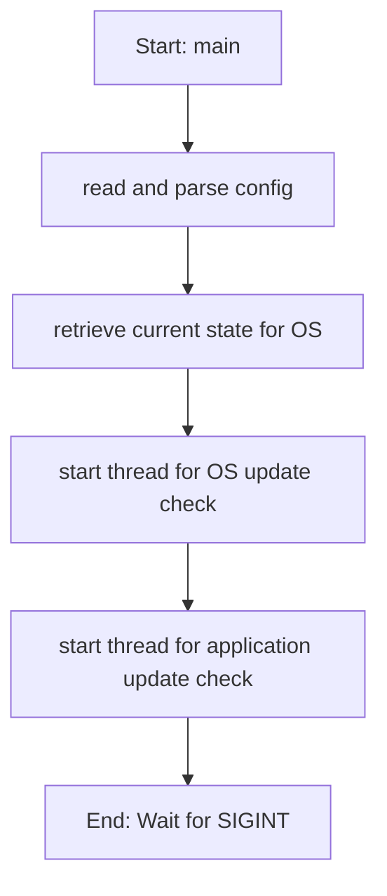
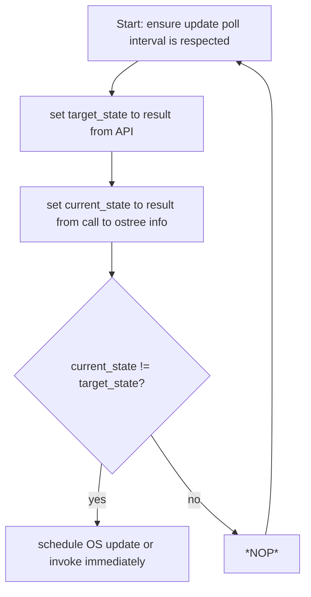
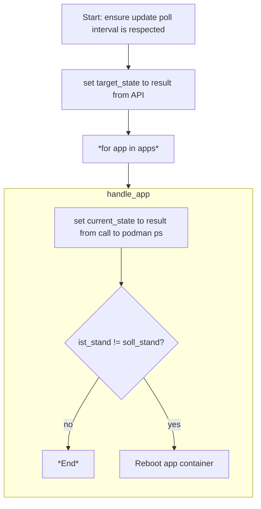

# Basic overview of event loop runnning on the agent

## Agent loop

```mermaid
flowchart TD
    A[Start: main] --> B[read and parse config]
    B --> C[retrieve current state for OS]
    C --> D[start thread for OS update check]
    D --> E[start thread for application update check]
	E --> F[End: Wait for SIGINT]
```

## OS update loop

```mermaid
flowchart TD
	A[Start: ensure update poll interval is respected] --> B[set target_state to result from API]
	B --> C[set current_state to result from call to ostree info]
	C --> D{current_state != target_state?}
	D -- yes --> E[schedule OS update or invoke immediately]
	D -- no --> F[*NOP*]
	F --> A
```

## Container update loop

```mermaid
flowchart TD
	direction TD
	A[Start: ensure update poll interval is respected] --> B[set target_state to result from API]
	B --> C[*for app in apps*]
	C --> handle_app

	subgraph handle_app
		direction TD
		A1[set current_state to result from call to podman ps] --> A2{ist_stand != soll_stand?}
		A2 -- no --> A3[*End*]
		A2 -- yes --> A4[Reboot app container]
	end
```
