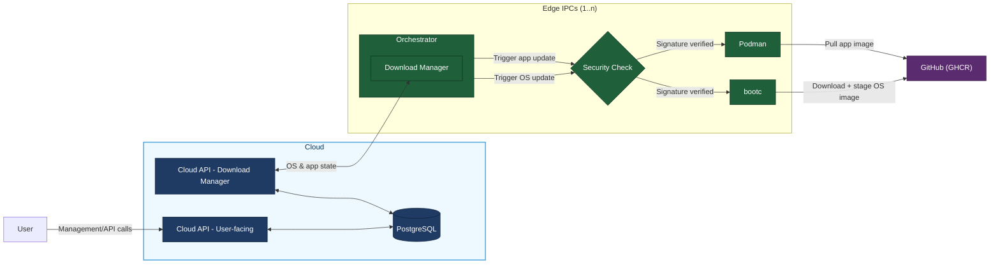

# Target Architecture

This document reflects the current target architecture

## 1. Goal

- A user operates the cloud via API/UI.
- The cloud persists current state of all Edge IPCs in PostgreSQL.
- The edge IPCs each run an `Orchestrator`.
- The `Orchestrator` checks whether OS/apps are up to date and triggers updates accordingly.
- Update artifacts are pulled from a product source (GHCR).

## 2. System Architecture

## 3. On-disk layout (bootc / Fedora / ostree)

The edge OS is a **bootc** image (Fedora bootc). The filesystem is split into
three regions with very different update semantics:

| Region | Mutability | Update behaviour |
| --- | --- | --- |
| `/usr` | read-only | shipped in the image; replaced atomically on every OS update; rolled back as a unit |
| `/etc` | writable | persists across updates; 3-way merged against the image's `/etc` so admin overrides survive |
| `/var` | writable | persists across updates; **populated from the image only on first boot** — later image changes to `/var` are *not* propagated |

This `/var` behaviour is the main footgun: paths like `/usr/local` and `/opt`
are symlinks to `/var/usrlocal` and `/var/opt` on Fedora bootc, so anything
installed there at image-build time effectively becomes a one-shot copy. The
orchestrator therefore lives in a true read-only path so OS updates actually
replace it.

| Path | Contents | Why this path |
| --- | --- | --- |
| `/usr/libexec/amos-orchestrator` | the orchestrator binary | `/usr` is read-only and atomic with OS updates; `/usr/libexec` is the [FHS](https://refspecs.linuxfoundation.org/FHS_3.0/fhs/ch04s07.html) location for system-service binaries not meant to be invoked from `$PATH` |
| `/etc/amos/config.toml` | orchestrator config (cloud URL, poll interval, device ID, inventory path) | `/etc` is writable and merged across updates, so admin overrides persist |
| `/var/lib/amos/inventory.json` | device inventory written by the orchestrator at runtime | `/var/lib/<app>` is the standard location for service state |

The systemd unit (`/etc/systemd/system/orchestrator.service`) ships in the
image and points `ExecStart` at `/usr/libexec/amos-orchestrator`. In the dev
VM, a systemd drop-in overrides this to a writable path — see
[`dev-env/lima/README.md`](../dev-env/lima/README.md).

## 4. Main Control Loop (Concept)

1. `Orchestrator` polls `Cloud API (Download Manager)`.
2. Cloud returns desired state for OS and applications.
3. If update is needed:
   - OS path via `bootc`
   - App path via `Podman`
4. `Orchestrator` reports update result/status to cloud.
5. Cloud stores state in PostgreSQL.
