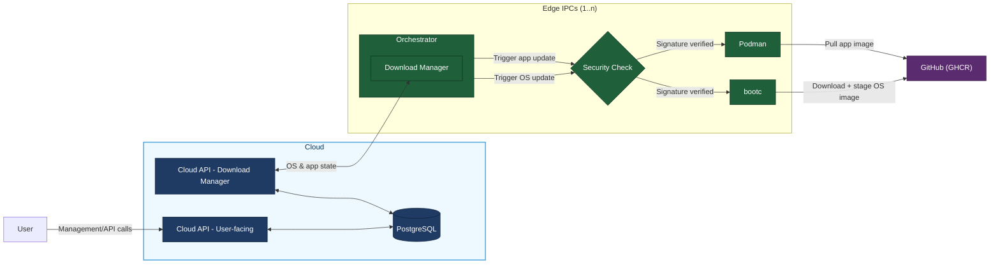

# Target Architecture

This document reflects the current target architecture

## 1. Goal

- A user operates the cloud via API/UI.
- The cloud persists current state of all Edge IPCs in PostgreSQL.
- The edge IPCs each run an `Orchestrator`.
- The `Orchestrator` checks whether OS/apps are up to date and triggers updates accordingly.
- Update artifacts are pulled from a product source (GHCR).

## 2. System Architecture

## 3. Main Control Loop (Concept)

1. `Orchestrator` polls `Cloud API (Download Manager)`.
2. Cloud returns desired state for OS and applications.
3. If update is needed:
   - OS path via `bootc`
   - App path via `Podman`
4. `Orchestrator` reports update result/status to cloud.
5. Cloud stores state in PostgreSQL.
