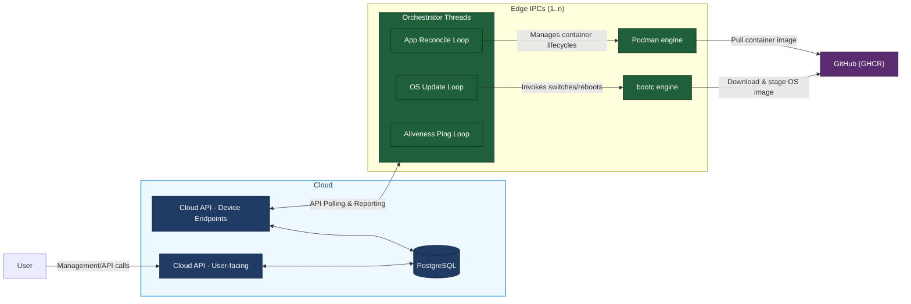
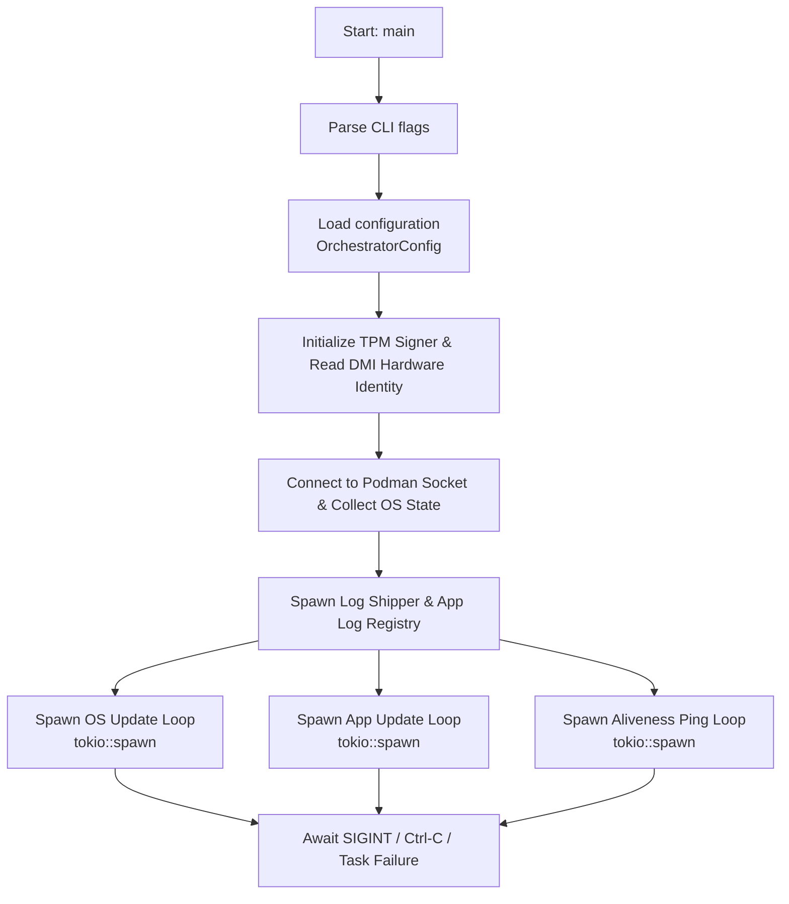

# Design Documentation

## Zero-Downtime Linux Updates — Software Architecture

This document describes the software architecture, component design, and internal data flows of the Zero-Downtime Linux Updates project.

---

## Table of Contents

1. [System Goals](#system-goals)
2. [System Architecture](#system-architecture)
3. [Component Diagram](#component-diagram)
4. [Component Descriptions](#component-descriptions)
5. [Orchestrator](#orchestrator)
6. [Key Data Structures](#key-data-structures)
7. [Agent Event Loop](#agent-event-loop)
8. [OS Update Loop](#os-update-loop)
9. [Application Update Loop](#application-update-loop)
10. [API Contract](#api-contract)
11. [Configuration System](#configuration-system)
12. [Inventory System](#inventory-system)

---

## System Goals

- A user operates the cloud via API/UI.
- The cloud persists current state of all Edge IPCs in PostgreSQL.
- The edge IPCs each run an `Orchestrator`.
- The `Orchestrator` checks whether OS/apps are up to date and triggers updates accordingly.
- Update artifacts are pulled from a product source (GHCR).

## System Architecture



---

## Component Descriptions

### `amos-orchestrator` (binary crate)

The main agent running on each Edge IPC. Responsible for:

- Reading configuration on startup
- Collecting the device inventory
- Spawning and managing two asynchronous update loops (OS and apps)
- Providing a `--self-check` mode for health verification

**Entry point:** `orchestrator/src/main.rs`

---

### `amos-common` (library crate)

Shared code used by both the orchestrator and the server:

- `api` module — defines the `CatalogResponse` and `CatalogResponseEntry` types (serializable to/from JSON)
- `util` module — Base64 newtype with serde support
- `download_manager` module — HTTP client construction, catalog polling, and artifact downloading

**Entry point:** `common/src/lib.rs`

---

### `amos-api-server` (binary crate)

A lightweight Axum-based HTTP server used during development and testing to simulate the Cloud API. Serves a hardcoded catalog and static download files from an `assets/` directory.

**Entry point:** `api-server/src/main.rs`

---

## Orchestrator

### Internal Module Structure

```
orchestrator/src/
├── main.rs           — CLI parsing, hardware detection, task initialization
├── config.rs         — TOML + env-var config mapping (OrchestratorConfig)
├── api_client.rs     — Type-safe client handling JWT auth, pings, logs, and state reports
├── application.rs    — Individual application lifecycle control loop and container wrapping
├── logging.rs        — Global tracing initialization, journald capturing, and API log shipping
├── loop_apps.rs      — Application state reconciliation loop (via Podman)
├── loop_os.rs        — OS upgrade coordination loop (via bootc wrapper)
├── loop_ping.rs      — High-frequency aliveness tracking heartbeat loop
├── podman/           — Podman connection wrapper and log registry pipelines
└── util/             — low-level executer, hardware identity, and TPM 2.0 handlers
```

### Subsystem Deep Dive

#### Application Log Aggregation & Backpressure

The Orchestrator centralizes container log collection via an asynchronous multiplexing registry task.

- **Timestamp Extraction:** Containers are tailed with runtime-enforced timestamps. The ingestion pipeline strips the RFC3339-nano prefix applied by the container engine to preserve the exact execution time, falling back to local time only if the log line lacks a valid prefix.
- **Flushing and Batching:** To minimize network overhead, logs are grouped into batches (`log_max_batch`) and pushed periodically (`log_flush_interval_secs`).
- **Memory Protection (Backpressure):** If connection to the Cloud API fails, logs are buffered in memory up to a hard cap (`log_max_buffer`). When the buffer fills completely, backpressure is enforced by evicting the oldest log lines first, preventing edge device out-of-memory (OOM) faults.

#### Subprocess Execution & Lifecycle Exit Codes

Operating system updates (`bootc`) and system-level actions are safely wrapped inside an isolated command execution layer.

- **Stream Deadlocks:** The executer drains `stdout` and `stderr` streams concurrently using asynchronous line loops. This ensures that fast-exiting processes do not leave unread data in system buffers, avoiding truncated logs.
- **Reboot Imminence (Exit Code 137):** Processes terminated without a clean status return or killed by system signals return exit code `137`. During OS upgrade and rollback phases, code `137` is explicitly intercepted and handled as a successful transaction, indicating that the system engine is dropping execution to perform an immediate hardware reboot.

#### Hardware Identity & TPM 2.0 Security

The system binds device identity and authorization tokens directly to physical (or emulated) hardware primitives.

##### Hardware Identity Paths

The Orchestrator validates identity via DMI/SMBIOS tables using the following files:

- Primary Unique Identifier: `/sys/class/dmi/id/product_uuid`
- Fallback Identifier: `/sys/class/dmi/id/board_serial` (utilized to accommodate specific university reference hardware constraints).

> Note: String validation rules automatically reject generic OEM placeholders such as "Not Specified" or "To Be Filled By O.E.M.".

#### Cryptographic Architecture & Handle Allocation

Device security relies on a TPM 2.0 interface communicating over `/dev/tpmrm0`. Cryptographic operations adhere to the following layout:

| Asset / Operation | Primitive Details | TPM Handle / Path Constraint |
| --- | --- | --- |
| **Endorsement Key (EK)** | RSA Public Key extraction | `0x8101_0001` (Read directly via reference convention) |
| **Device Signing Key** | 2048-bit RSA (Owner hierarchy) | `0x8100_A038` (Created and persisted if missing) |
| **Data Signing Scheme** | RSASSA-PKCS1-v1_5 + SHA256 | Handled in an isolated Null-Auth session |

#### Proactive JWT Management

Cloud API interactions require a Device JWT signed by the TPM. To maintain an uninterrupted connection state, the system employs a proactive refresh window: token validity is re-evaluated during every cycle, and a new signed JWT is requested exactly `30 seconds` prior to token expiration (`REFRESH_BEFORE`), preventing request drops caused by clock drift.

#### Cross-Loop Interlocking (OS Upgrade Freeze)

To prevent container mutations or log shipping corruption while the host system undergoes structural upgrades, the Orchestrator employs a thread-safe synchronization state (`os_upgrade_in_progress: Arc<AtomicBool>`).

- **Behavior:** Whenever an OS update is being actively applied (either immediately or following the expiration of a deferred timer), this atomic flag is flipped to `true`.
- **Impact:** The application reconciliation loop instantly freezes its execution cycle, printing a diagnostic freeze message and bypassing any container creation, modification, or teardown tasks until the system initiates its hardware reboot.

---

## Key Data Structures

### `OrchestratorConfig` (Configuration)

Parsed dynamically from files and environment variables into a structured configuration state.

```rust
pub struct OrchestratorConfig {
    pub cloud_url: String,
    pub https_proxy: Option<String>,
    pub podman_path: String,
    pub poll_interval_secs: u64,
    pub log_flush_interval_secs: u64,
    pub log_max_batch: usize,
    pub log_max_buffer: usize,
    pub deferred_switch_timer_secs: u64,
}
```

### `OsState`

```rust
pub struct OsState {
    pub update_pending: bool,
    pub booted_checksum: String,
    pub booted_image_ref: Option<String>,
    pub staged_checksum: Option<String>,
    pub staged_image_ref: Option<String>,
    pub countdown_started: bool,
}
```

### `AppState`

```rust
pub struct Application {
    pub image_reference: String,
    pub image_digest: String,
    pub application_id: i32,
    pub application_config_id: Option<i32>,
    pub lifecycle_loop: tokio::task::JoinHandle<()>,
    pub delete_notifier: Arc<tokio::sync::Notify>,
}
```

### `Settings` (config)

```rust
pub struct Settings {
    pub database_url: String,
    pub timescale_database_url: String,
    pub http_port: u16,
    pub jwt: JwtConfig,
    pub audit: AuditConfig,
}
```

### `CatalogResponseEntry` (API)

```rust
pub struct ApiClient {
    client: reqwest::Client,
    base_url: String,
    device_uuid: String,
    serial_number: String,
    jwt_provider: tokio::sync::Mutex<DeviceJwtProvider>,
}
```

---

## Agent Event Loop

1. `Orchestrator` polls `Cloud API`.
2. Cloud returns desired state for OS and applications.
3. If update is needed:
   - OS path via `bootc`
   - App path via `Podman`
4. `Orchestrator` reports update result/status to cloud.
5. Cloud stores state in PostgreSQL.



---

## OS Update Flow

The OS tracking subsystem utilizes the `/device/os` API endpoint and communicates with `bootc` to manage image deployments.

1. **Evaluation:** Compares the active `booted_checksum` or `booted_image_ref` against the target state `commit_hash`.
2. **Immediate Execution:** If the API specifies `immediate: true`, the application loops are locked via `os_upgrade_in_progress`, and the system executes a direct `bootc switch` followed by `bootc apply` to trigger an instant hardware reboot.
3. **Deferred Execution:** If `immediate: false`, the system fetches and stages the new container image layer. It then spawns a background countdown thread matching `deferred_switch_timer_secs`. When the timer expires, it locks container updates and calls `bootc apply` to complete the deployment.

---

## Application Update Loop

The application update loop matches host states against cloud assignments using an automated, type-safe state machine.

1. Ticks regularly according to the configured `poll_interval_secs`.
2. Checks the `os_upgrade_in_progress` barrier flag; if an OS update is processing, the cycle skips.
3. Fetches the target array from `/device/apps` and sorts both the current applications and target definitions by image reference names.
4. Executes a `ReconcileIterator` pass to determine structural differences:
   - **Missing from Host:** Invokes `Application::launch_from_image` to trigger image pulling and container execution.
   - **Mismatched Digest / Config ID:** Shuts down the current container instance cleanly via its `Notify` handle, purges the older deployment, and launches the updated variant.
   - **Orphaned on Host:** Demolishes unassigned active container environments.
5. Invokes `podman.prune_images()` automatically to release storage volumes occupied by stale image layers.

---

## Rollback & Error Recovery

- **OS rollback:** If a `bootc switch` fails, bootc will rollback automatically.
- **App rollback:** If a container update fails, the previous image will be re-pulled.
- **Retry logic:** Failed updates will be retried with exponential backoff before a rollback is triggered.

---

## Configuration System

Configuration is resolved in this priority order (highest wins):

```
Environment variables (APP_*)
        ↓
TOML config file (--config or config.toml)
        ↓
Built-in defaults
```

> See [User Documentation — Configuration](user_documentation.md#configuration) for all available keys, defaults, and constraints.
