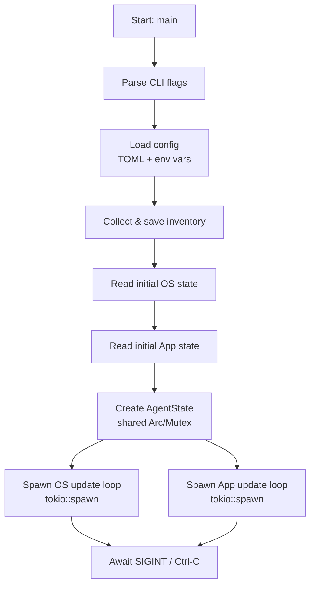
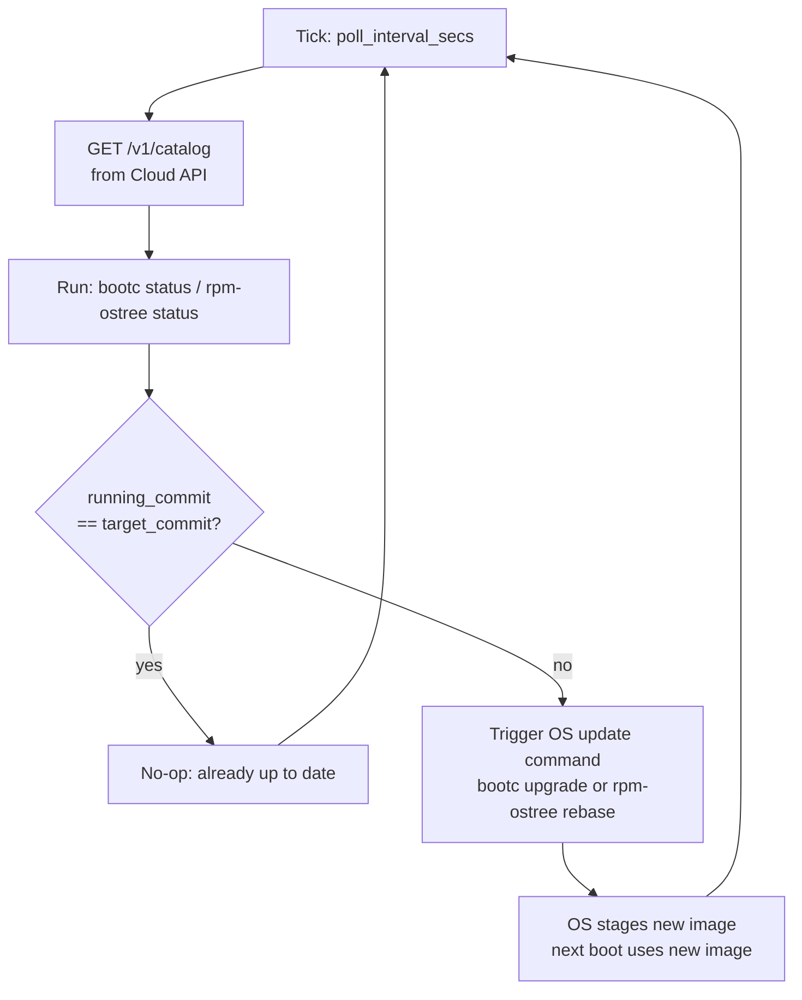

# Design Documentation

## Zero-Downtime Linux Updates — Software Architecture 

This document describes the software architecture, component design, and internal data flows of the Zero-Downtime Linux Updates project.

---

## Table of Contents

1. [System Overview](#system-overview)
2. [Component Diagram](#component-diagram)
3. [Component Descriptions](#component-descriptions)
4. [Internal Module Structure — Orchestrator](#internal-module-structure--orchestrator)
5. [Key Data Structures](#key-data-structures)
6. [Agent Event Loop](#agent-event-loop)
7. [OS Update Loop](#os-update-loop)
8. [Application Update Loop](#application-update-loop)
9. [Security Module](#security-module)
10. [Download Manager](#download-manager)
11. [API Contract](#api-contract)
12. [Configuration System](#configuration-system)
13. [Inventory System](#inventory-system)
14. [Crate Dependency Overview](#crate-dependency-overview)

---

## System Overview

The system enables **zero-downtime OS and application updates** for Edge IPC devices. Each device runs an **Orchestrator** agent that:

1. Reads configuration and collects a local device inventory on startup.
2. Runs two concurrent polling loops — one for OS state, one for application container state.
3. Compares current host state against a target state and triggers updates when they differ.
4. Writes the device inventory to a local JSON file.

> **Note:** The Cloud API integration, actual `bootc`/`rpm-ostree` update commands, and Podman container management are currently implemented as **placeholder stubs**. The reconciliation logic and data structures are in place; the external command calls will be wired in future sprints.

---

## Component Diagram

see [architecture.md](architecture.md)

---

## Component Descriptions

### `amos-orchestrator` (binary crate)

The main agent running on each Edge IPC. Responsible for:
- Reading configuration on startup
- Collecting the device inventory
- Spawning and managing two asynchronous update loops (OS and apps)
- Providing a `--self-check` mode for health verification

**Entry point:** `orchestrator/src/main.rs`

---

### `amos-common` (library crate)

Shared code used by both the orchestrator and the mock server:
- `api` module — defines the `CatalogResponse` and `CatalogResponseEntry` types (serializable to/from JSON)
- `util` module — Base64 newtype with serde support
- `download_manager` module — HTTP client construction, catalog polling, and artifact downloading

**Entry point:** `common/src/lib.rs`

---

### `amos-api-mock-server` (binary crate)

A lightweight Axum-based HTTP server used during development and testing to simulate the Cloud API. Serves a hardcoded catalog and static download files from an `assets/` directory.

**Entry point:** `api-mock-server/src/main.rs`

---

## Internal Module Structure — Orchestrator

```
orchestrator/src/
├── main.rs           — CLI parsing, startup, spawns async tasks
├── config_loader.rs  — TOML + env-var config loading and validation
├── state.rs          — AgentState, OsState, AppState (shared async state)
├── os_tree.rs        — OS update polling loop (bootc / rpm-ostree)
├── apps.rs           — Application container update loop (Podman)
├── inventory.rs      — Device inventory collection and JSON serialization
└── healthcheck.rs    — Self-check logic (config + inventory validation)
```

---

## Key Data Structures

### `AgentState`

Shared state across all async tasks. Protected by `Arc<Mutex<>>`.

```rust
pub struct AgentState {
    pub self_version: String,           // binary version from Cargo.toml
    pub config: Settings,               // loaded config
    pub os_state: Arc<Mutex<OsState>>,  // current OS state
    pub apps_state: Arc<Mutex<Vec<AppState>>>, // current app container states
}
```

### `OsState`

```rust
pub struct OsState {
    pub update_pending: bool,                    // update staged but not yet rebooted
    pub running_ostree_commit: String,           // current booted commit/image tag
    pub update_ostree_commit: Option<String>,    // target commit/image if update available
}
```

### `AppState`

```rust
pub struct AppState {
    pub app_id: String,   // Podman image name
    pub version: String,  // image tag
    pub updating: bool,   // update currently in progress
}
```

### `Settings` (config)

```rust
pub struct Settings {
    pub cloud_url: String,         // Cloud API base URL (must be https://)
    pub poll_interval_secs: u32,   // polling interval in seconds
}
```

### `CatalogResponseEntry` (API)

```rust
pub struct CatalogResponseEntry<'a> {
    pub name: &'a str,         // "os" or app name
    pub version: &'a str,      // semantic version string
    pub url: &'a str,          // image URL or download path
    pub signature: Base64<'a>, // ed25519 signature of the artifact
}
```

---

## Agent Event Loop



---

## OS Update Flow



---

## Application Update Loop

> **Current status:** The reconciliation scaffold is implemented in `apps.rs`. Target and host app states are currently **hardcoded stub values**. The container management functions (`create_container`, `update_container`, `delete_container`) are **placeholders** — they accept arguments but perform no operations.

The loop:
1. Ticks every `poll_interval_secs`.
2. Fetches a target app state (stub: one app `data_collector` at `v1.0.2`).
3. Fetches the current host app state (stub: same app at `v1.0.1`).
4. Updates the shared `apps_state` with the host state.
5. Reconciles differences:
   - App in target but not running → `create_container()` (placeholder)
   - App running with wrong version → `update_container()` (placeholder)
   - App running but not in target → `delete_container()` (placeholder)
   - App up to date → no-op

---

## Security Module

The `security-module` module provides one public async function:

```rust
pub async fn verify_signature(
    file_path: &Path,
    signature_bytes: &[u8],
    public_key_bytes: &[u8],
) -> bool
```

- Algorithm: **Ed25519** (via `ed25519-dalek` crate)
- Reads the file from disk asynchronously and verifies the provided signature against the provided public key.
- Returns `false` (never panics) if the file cannot be read, the key bytes are malformed, or the signature does not match.

---

## Rollback & Error Recovery

> **Future sprint:** Rollback and error recovery logic is not yet implemented in the Orchestrator.

The OS inventory already tracks rollback availability (`bootc_status.rollback`, `bootc_status.rollback_queued`), providing a data foundation for future rollback triggers. Planned behaviour:

- **OS rollback:** If a `bootc upgrade` or `rpm-ostree rebase` fails, the Orchestrator will call `bootc rollback` / `rpm-ostree rollback` and report the failure to the Cloud API.
- **App rollback:** If a container update fails, the previous image will be re-pulled.
- **Retry logic:** Failed updates will be retried with exponential backoff before a rollback is triggered.

---

## Download Manager

> **Current status:** The Download Manager is a standalone module in `amos-common`. It is **not yet called** by the Orchestrator's update loops (which currently use hardcoded stubs instead).

Located in `common/src/download_manager.rs`. Provides:

| Function | Description |
|----------|-------------|
| `build_http_client(config)` | Creates a `reqwest::Client`, optionally configuring an HTTPS proxy |
| `check_for_update(client, config)` | `GET /v1/catalog` — returns the full catalog response |
| `download_update(client, entry, config)` | Streams an artifact to disk as `update_<name>_<version>.bin` |

The HTTPS proxy can be set in `Config.https_proxy` or via the `https_proxy` environment variable (reqwest default).

---

## API Contract

### `GET /v1/catalog`

Returns a JSON array of available artifacts:

```json
[
  {
    "name":      "os",
    "version":   "1.2.3",
    "url":       "ghcr.io/amosproj/amos2026ss01-zero-downtime-linux-updates-system",
    "signature": "<base64-encoded ed25519 signature>"
  },
  {
    "name":      "app",
    "version":   "4.5.6",
    "url":       "/v1/download/app4.5.6",
    "signature": "<base64-encoded ed25519 signature>"
  }
]
```

### `GET /v1/download/<filename>`

Serves binary update artifact files (mock server only).

---

## Configuration System

Configuration is resolved in this priority order (highest wins):

```
Environment variables (APP_*)
        ↓
TOML config file (--config or config.toml)
        ↓
Built-in defaults
```

> See [User Documentation — Configuration](user_documentation.md#configuration) for all available keys, defaults, and constraints.

---

## Crate Dependency Overview

```
workspace
├── amos-orchestrator (bin)
│   └── amos-common (lib)
│       └── reqwest, serde, serde_json, tokio, futures-util
│   └── clap, config, ed25519-dalek, env_logger, log, anyhow, tokio
│
└── amos-api-mock-server (bin)
    └── amos-common (lib)
    └── axum, tower-http, tokio
```
