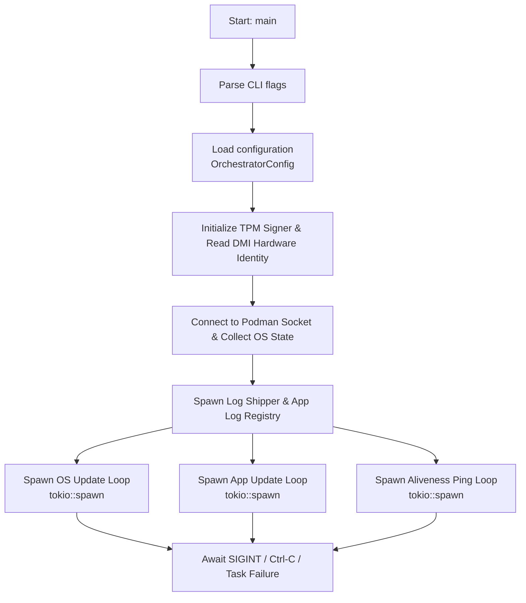

# Design Documentation

## Zero-Downtime Linux Updates — Software Architecture

This document describes the software architecture, component design, and internal data flows of the Zero-Downtime Linux Updates project.

---

## Table of Contents

1. [System Overview](#system-overview)
2. [Component Diagram](#component-diagram)
3. [Component Descriptions](#component-descriptions)
4. [Internal Module Structure — Orchestrator](#internal-module-structure--orchestrator)
5. [Key Data Structures](#key-data-structures)
6. [Agent Event Loop](#agent-event-loop)
7. [OS Update Loop](#os-update-loop)
8. [Application Update Loop](#application-update-loop)
9. [API Contract](#api-contract)
10. [Configuration System](#configuration-system)
11. [Inventory System](#inventory-system)

---

## System Overview

The system enables **zero-downtime OS and application updates** for Edge IPC devices. Each device runs an **Orchestrator** agent that:

1. Reads configuration on startup.
2. Runs two concurrent polling loops — one for OS state, one for application container state.
3. Compares current host state against a target state and triggers updates when they differ.
4. Writes the device inventory to a local JSON file.

---

## Component Diagram

see [architecture.md](architecture.md)

---

## Component Descriptions

### `amos-orchestrator` (binary crate)

The main agent running on each Edge IPC. Responsible for:

- Reading configuration on startup
- Collecting the device inventory
- Spawning and managing two asynchronous update loops (OS and apps)
- Providing a `--self-check` mode for health verification

**Entry point:** `orchestrator/src/main.rs`

---

### `amos-common` (library crate)

Shared code used by both the orchestrator and the server:

- `api` module — defines the `CatalogResponse` and `CatalogResponseEntry` types (serializable to/from JSON)
- `util` module — Base64 newtype with serde support
- `download_manager` module — HTTP client construction, catalog polling, and artifact downloading

**Entry point:** `common/src/lib.rs`

---

### `amos-api-server` (binary crate)

A lightweight Axum-based HTTP server used during development and testing to simulate the Cloud API. Serves a hardcoded catalog and static download files from an `assets/` directory.

**Entry point:** `api-server/src/main.rs`

---

## Internal Module Structure — Orchestrator

```
orchestrator/src/
├── main.rs           — CLI parsing, hardware detection, task initialization
├── config.rs         — TOML + env-var config mapping (OrchestratorConfig)
├── api_client.rs     — Type-safe client handling JWT auth, pings, logs, and state reports
├── application.rs    — Individual application lifecycle control loop and container wrapping
├── logging.rs        — Global tracing initialization, journald capturing, and API log shipping
├── loop_apps.rs      — Application state reconciliation loop (via Podman)
├── loop_os.rs        — OS upgrade coordination loop (via bootc wrapper)
├── loop_ping.rs      — High-frequency aliveness tracking heartbeat loop
├── podman/           — Podman connection wrapper and log registry pipelines
└── util/             — low-level executer, hardware identity, and TPM 2.0 handlers
```

---

## Key Data Structures

### `OrchestratorConfig` (Configuration)

Parsed dynamically from files and environment variables into a structured configuration state.

```rust
pub struct OrchestratorConfig {
    pub cloud_url: String,
    pub https_proxy: Option<String>,
    pub podman_path: String,
    pub poll_interval_secs: u64,
    pub log_flush_interval_secs: u64,
    pub log_max_batch: usize,
    pub log_max_buffer: usize,
    pub deferred_switch_timer_secs: u64,
}
```

### `OsState`

```rust
pub struct OsState {
    pub update_pending: bool,
    pub booted_checksum: String,
    pub booted_image_ref: Option<String>,
    pub staged_checksum: Option<String>,
    pub staged_image_ref: Option<String>,
    pub countdown_started: bool,
}
```

### `AppState`

```rust
pub struct Application {
    pub image_reference: String,
    pub image_digest: String,
    pub application_id: i32,
    pub application_config_id: Option<i32>,
    pub lifecycle_loop: tokio::task::JoinHandle<()>,
    pub delete_notifier: Arc<tokio::sync::Notify>,
}
```

### `Settings` (config)

```rust
pub struct Settings {
    pub database_url: String,
    pub timescale_database_url: String,
    pub http_port: u16,
    pub jwt: JwtConfig,
    pub audit: AuditConfig,
}
```

### `CatalogResponseEntry` (API)

```rust
pub struct ApiClient {
    client: reqwest::Client,
    base_url: String,
    device_uuid: String,
    serial_number: String,
    jwt_provider: tokio::sync::Mutex<DeviceJwtProvider>,
}
```

---

## Agent Event Loop



---

## OS Update Flow

The OS tracking subsystem utilizes the `/device/os` API endpoint and communicates with `bootc` to manage image deployments.

1. **Evaluation:** Compares the active `booted_checksum` or `booted_image_ref` against the target state `commit_hash`.
2. **Immediate Execution:** If the API specifies `immediate: true`, the application loops are locked via `os_upgrade_in_progress`, and the system executes a direct `bootc switch` followed by `bootc apply` to trigger an instant hardware reboot.
3. **Deferred Execution:** If `immediate: false`, the system fetches and stages the new container image layer. It then spawns a background countdown thread matching `deferred_switch_timer_secs`. When the timer expires, it locks container updates and calls `bootc apply` to complete the deployment.

---

## Application Update Loop

The application update loop matches host states against cloud assignments using an automated, type-safe state machine.

1. Ticks regularly according to the configured `poll_interval_secs`.
2. Checks the `os_upgrade_in_progress` barrier flag; if an OS update is processing, the cycle skips.
3. Fetches the target array from `/device/apps` and sorts both the current applications and target definitions by image reference names.
4. Executes a `ReconcileIterator` pass to determine structural differences:
   - **Missing from Host:** Invokes `Application::launch_from_image` to trigger image pulling and container execution.
   - **Mismatched Digest / Config ID:** Shuts down the current container instance cleanly via its `Notify` handle, purges the older deployment, and launches the updated variant.
   - **Orphaned on Host:** Demolishes unassigned active container environments.
5. Invokes `podman.prune_images()` automatically to release storage volumes occupied by stale image layers.

---

## Rollback & Error Recovery

- **OS rollback:** If a `bootc switch` fails, bootc will rollback automatically.
- **App rollback:** If a container update fails, the previous image will be re-pulled.
- **Retry logic:** Failed updates will be retried with exponential backoff before a rollback is triggered.

---

## Configuration System

Configuration is resolved in this priority order (highest wins):

```
Environment variables (APP_*)
        ↓
TOML config file (--config or config.toml)
        ↓
Built-in defaults
```

> See [User Documentation — Configuration](user_documentation.md#configuration) for all available keys, defaults, and constraints.
