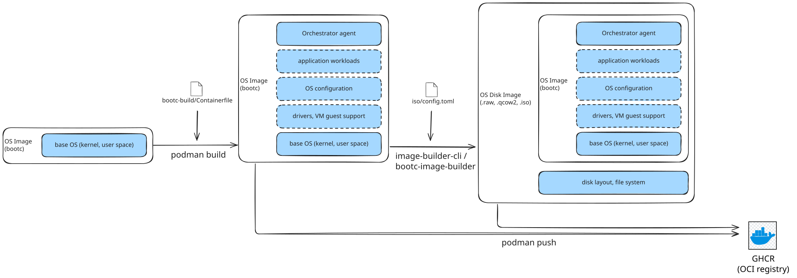
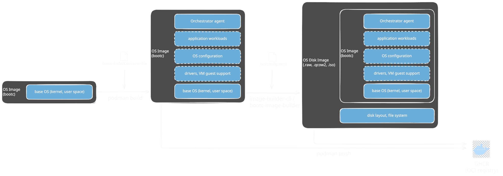

# Fundamentals: OS Images & bootc

A short primer on the image-based OS model this project is built on. It explains
what a *bootc* image is, how it differs from a disk image, and — most importantly
— how we install a device once and then update, upgrade, and roll back the **whole
operating system** from a single container image in GHCR.

## Why an image-based OS?

Instead of managing individual packages on each device, the entire operating
system — and optionally its configuration and applications — is **versioned,
built, deployed, and updated as a single unit**. The payoff:

- **No drift.** Every device runs the exact image we tested. There is no
  per-device package state that slowly diverges.
- **Transactional updates.** An update is staged as a new deployment and only
  becomes active on reboot. If it fails, the device **rolls back** to the
  previous deployment automatically.

## Bootable container images (bootc)

We ship the OS as a normal **OCI container image** built with a `Containerfile`,
just like an application container. The difference is that the image is *bootable*:
[`bootc`](https://bootc.dev/) knows how to install it onto a disk
and, later, to update a running system to a newer version of that same image.

> A **bootc image is a file-system image** — it contains the OS files (and their
> attributes) but *not* a disk layout. The partitions and file systems have to be
> created first. That is the job of a **disk image**.

### OS image vs. OS disk image

|                       | **OS image (bootc)**                          | **OS disk image**                                            |
| --------------------- | --------------------------------------------- | ------------------------------------------------------------ |
| Contains              | OS files only                                 | Disk layout + bootloader + file systems + the OS files       |
| Format                | OCI container image (in a registry)           | `.raw`, `.qcow2`, `.iso`                                      |
| Used for              | **Updating** an already-installed device      | **First-time provisioning** of a device                      |

A disk image can be written verbatim to a drive; a bootc image cannot. This split
is what lets us provision a device **once** and then update it forever without
ever re-partitioning it.

## The build & publish flow

  
  

1. **Start from a base bootc image** — `quay.io/fedora/fedora-bootc`.
2. **Layer our software** with [`bootc-build/Containerfile`](https://github.com/amosproj/amos2026ss01-zero-downtime-linux-updates/blob/main/bootc-build/Containerfile):
   the `amos-orchestrator` agent, its systemd unit, greenboot health checks, and
   the TPM/cloud-init dependencies.
3. **Build & push the OS image** with `podman build` / `podman push` to GHCR:
   `ghcr.io/amosproj/amos2026ss01-zero-downtime-linux-updates-system`. **This is
   the image every device boots and updates from.**
4. **Generate disk images** from that bootc image, only for first-time installs:
   - `image-builder-cli` → `.qcow2` and `.raw` (VM disk images),
   - `bootc-image-builder` → `.iso` (bare-metal installer).

The CI pipeline does all of this automatically — see
[Build documentation](./build_documentation.md) and the [CI pipeline](./ci.md).

## Install once, then update via bootc

This is the part worth internalising. The disk images are used **exactly once per
device**:

- **Bare-metal IPC** → boot the **`.iso`** once; its Anaconda installer writes the
  OS to the internal drive.
- **Virtual machine** → boot the **`.qcow2`/`.raw`** image once to bring the VM up
  (e.g. the Lima dev VM, see [Dev Environment](./Dev_Environment.md)).

After that first install, **the disk images are never needed again.** Every
subsequent change to the operating system happens by pulling a new version of the
`-system` bootc image from GHCR:

| Action       | Command                                   | What happens                                                                 |
| ------------ | ----------------------------------------- | ---------------------------------------------------------------------------- |
| **Upgrade**  | `bootc upgrade`                           | Pulls a newer version of the *current* image ref, stages it, reboots into it |
| **Switch**   | `bootc switch <image-ref>`                | Moves the device to a *different* image ref (e.g. a new release tag)         |
| **Rollback** | `bootc rollback` (or automatic)           | Boots the previously-deployed image again                                    |

Each update is **atomic and staged**: the running system is untouched until the
next reboot, and the previous deployment is kept on disk. If the new image fails
to boot or fails its **greenboot** health checks, the device **rolls back
automatically** to the last known-good deployment — that is the zero-downtime
guarantee.

On our edge IPCs the `amos-orchestrator` agent drives this loop: it polls the
cloud for the desired OS version and invokes `bootc` to converge the device onto
it. See the [Architecture](./architecture.md) for how that fits together.

> **Key takeaway:** an IPC is installed from a disk image **once**. From then on
> the whole OS — upgrades, downgrades, and rollbacks — is just a container image
> in GHCR that `bootc` swaps in and out atomically.
