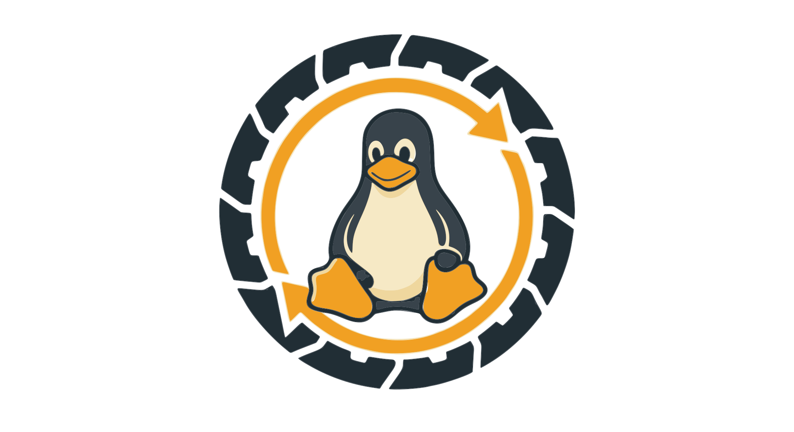

<p align="center">
  
</p>

<h1 align="center">Zero-Downtime Linux Updates</h1>

<p align="center">
  <em>Atomic, self-healing updates for fleets of Linux edge devices — the whole OS ships as a bootable container image.</em>
</p>

<p align="center">
  <a href="https://amosproj.github.io/amos2026ss01-zero-downtime-linux-updates/"></a>
  <a href="./LICENSE"></a>
</p>

<p align="center"><sub><b>Built with</b></sub></p>

<p align="center">
  <a href="https://www.rust-lang.org"></a>
  <a href="https://bootc.dev"></a>
  <a href="https://podman.io"></a>
  <a href="https://docs.fedoraproject.org/en-US/bootc/base-images/"></a>
  <a href="https://www.postgresql.org/"></a>
  <a href="https://github.com/timescale/timescaledb"></a>
</p>

<p align="center"><sub>AMOS SS 2026 · Project 01</sub></p>

---

An update system for fleets of Linux edge devices (industrial IPCs) where the
**entire operating system ships as a bootable container image**. Devices are
provisioned once, then updated forever by pulling a new image — each OS update is
atomic and staged, and the **OS rolls back automatically** if a new version fails
to boot or fails its health checks.

## How it works

- **The OS is a container image.** We build a bootable OS image with
  [`bootc`](https://bootc.dev/) and publish it to GHCR, the same way you'd build
  and push an application container.
- **An on-device agent drives updates.** `amos-orchestrator` runs on each device,
  polls the cloud API for the OS and application versions it should be running,
  and invokes `bootc` and `podman` to converge onto that state.
- **The cloud holds the desired state.** A user manages the fleet through the
  cloud API; the cloud persists per-device state in PostgreSQL and hands each
  device its target state on request.

```
   User ──▶ Cloud API ──▶ PostgreSQL
                 ▲
                 │ poll desired state / report status
                 ▼
   Edge device: amos-orchestrator ──▶ bootc   (OS updates)
                                  └─▶ podman  (app containers)
                 ▲
                 │ pull OS & app images
              GHCR (product source)
```

## Documentation

> [!TIP]
> Full documentation — fundamentals, architecture, build, and user guides — is
published at **[amosproj.github.io/…/zero-downtime-linux-updates](https://amosproj.github.io/amos2026ss01-zero-downtime-linux-updates/)**.

| Guide | For |
| --- | --- |
| [Fundamentals: OS Images & bootc](https://amosproj.github.io/amos2026ss01-zero-downtime-linux-updates/docs/image-based-os.html) | Newcomers — start here |
| [Architecture & Design](https://amosproj.github.io/amos2026ss01-zero-downtime-linux-updates/docs/architecture_and_design_documentation.html) | How the pieces fit together |
| [User documentation](https://amosproj.github.io/amos2026ss01-zero-downtime-linux-updates/docs/user_documentation.html) | Installing & operating the orchestrator |
| [Build documentation](https://amosproj.github.io/amos2026ss01-zero-downtime-linux-updates/docs/build_documentation.html) | Building images, containers & ISOs |
| [Log API (TimescaleDB)](https://amosproj.github.io/amos2026ss01-zero-downtime-linux-updates/docs/log_api.html) | Device log streaming |
| [Development environment](https://amosproj.github.io/amos2026ss01-zero-downtime-linux-updates/docs/Dev_Environment.html) | Local VM & dev tooling |
| [CI pipeline](https://amosproj.github.io/amos2026ss01-zero-downtime-linux-updates/docs/ci.html) | What runs on every PR |

New to the project? Read **Fundamentals: OS Images & bootc**, then
**Architecture & Design**.

## Glossary

<details>
<summary>Product glossary — key terms used across the docs and code</summary>

| Term | Definition |
| --- | --- |
| **Edge Device / Edge IPC** | An industrial Inter-Process Communication (IPC) hardware asset on the factory floor that this project runs on. |
| **Orchestrator** | The central automated controller in the Edge Agent. It executes the update cycle by interpreting the remote configuration, monitoring local status, and sequentially triggering download, verification, and installation to align the device with the cloud's target state. |
| **Device Identity / uuid** | A unique identifier permanently bound to a physical Edge Device, derived from its onboard hardware. |
| **Inventory Database** | Cloud database storing all Edge Device, application, and OS information, including each device's currently deployed and desired OS/application versions. |
| **Health Check** | Automated local test scripts run immediately after a switch or reboot to verify critical services before an update is confirmed. |
| **Rollback** | Automated emergency recovery that instantly reverts a device to its previous working OS image or application stack when a post-update health check fails. |
| **Fleet** | All edge devices managed by one company/user. |
| **Tenant** | The customer where the Edge Device and its associated machinery is located. |
| **Group** | A set of Edge Devices modified together (e.g. production, testing). |
| **Cloud** | The Inventory Database plus the APIs the user and Edge IPC communicate through. |

</details>

## Repository layout

| Path | What it is |
| --- | --- |
| `orchestrator/` | The on-device agent binary (`amos-orchestrator`) |
| `api-server/` | Cloud API server binary (`amos-api-server`) |
| `common/` | Shared library crate (API types, DTOs, download manager) |
| `bootc-build/` | Containerfile, systemd unit, and greenboot checks for the OS image |
| `log-tui/` | Terminal UI for live device logs |
| `Documentation/` | Project documentation (mdBook source) |
| `scripts/` | Build, test, and helper scripts |
| `dev-env/` | Local edge-device VM (Lima) and dev tooling |
| `demo/` | Scripts and compose files for the live demo setup |

## Try it out

To boot a test edge device in a local VM and watch the update agent run, see
[`dev-env/lima/README.md`](./dev-env/lima/README.md). It walks through what the
setup does, how to start it, and the key paths inside the VM.

## Building

```sh
git clone https://github.com/amosproj/amos2026ss01-zero-downtime-linux-updates.git
cd amos2026ss01-zero-downtime-linux-updates
make setup          # one-time: commit template + DCO sign-off hook
cargo build         # build all workspace crates
```

See the [Build documentation](https://amosproj.github.io/amos2026ss01-zero-downtime-linux-updates/docs/build_documentation.html)
for images, containers, and deployment.

### Make targets

`make` (or `make help`) lists everything the project can build and run:

<details>
<summary>Show all targets</summary>

```text
demo-edge            Boot a fresh Lima VM with just the orchestrator (no mock server/DB); prompts for VM name/device uuid/serial/cloud url
demo-logs            Start the live log TUI against the demo API server (override DEMO_API_URL/DEMO_DEVICE for another run)
demo-server          Bring up the full e2e stack, primed and left running for a live demo (send commands with scripts/demo_api.sh)
dev-deploy-container Cross-build orchestrator in a container for the running VM and hot-swap+restart
dev-deploy           Build orchestrator with the host's cargo (no container) and hot-swap+restart
docs-book            Build only the mdBook prose (skips rustdoc; works where the TPM crate can't compile, e.g. macOS)
docs-serve           Build the full docs website and serve it locally (DOCS_PORT, default 8000)
docs                 Build the full documentation website (rustdoc + mdBook) into ./target/doc
e2e                  Run the full e2e suite against a freshly recreated Lima VM
help                 Show available targets
image-amd64          Build amd64 disk image (cross-arch if host is arm64; needs qemu-user-static)
image-arm64          Build arm64 disk image (cross-arch if host is amd64; needs qemu-user-static)
image-clean          Remove locally built disk images
image                Build bootc disk image (qcow2 + raw) for host arch into ./dist
iso-amd64            Build amd64 installer ISO (cross-arch if host is arm64; needs qemu-user-static)
iso-arm64            Build arm64 installer ISO (cross-arch if host is amd64; needs qemu-user-static)
iso-clean            Remove built installer ISO artifacts
iso                  Build installer ISO for host arch into ./dist/bootiso/install.iso
pull-image-amd64     Download prebuilt amd64 disk image (qcow2) from GHCR
pull-image-arm64     Download prebuilt arm64 disk image (raw) from GHCR
pull-image           Download prebuilt disk image from GHCR for host arch into ./dist
setup-hooks          Install git hooks
setup-template       Configure the commit message template
setup                Set up local development environment
```

</details>

## Demo

- [Demo-day slides](./Deliverables/sprint-13/Demo_Day_Slides.pdf) (PDF)
- [Demo video](./Deliverables/sprint-12/demo-video.mkv)
- Reproduce it locally with `make demo-server`, `make demo-edge` (see [`demo/README`](./demo/edge/README.md)).

## Project links

- [Feature board](https://github.com/orgs/amosproj/projects/97)
- [Imp-squared backlog](https://github.com/orgs/amosproj/projects/101/views/1)
- [Documentation site](https://amosproj.github.io/amos2026ss01-zero-downtime-linux-updates/)

## Contributing

Please read [CONTRIBUTING.md](./CONTRIBUTING.md) for our development workflow,
commit conventions, and how to submit pull requests. This project uses the
[Developer Certificate of Origin](./DCO) — all commits must be signed off
(`git commit -s`). Run `make setup` after cloning to configure your local
environment.

## License

Released under the [MIT License](./LICENSE).
</content>
</invoke>
